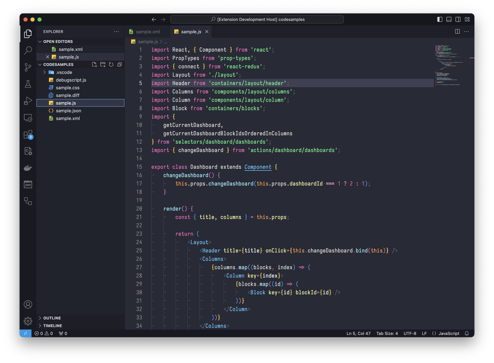

# Snazzyfied Theme

Colourful theme inspired by [hyper-snazzy](https://github.com/sindresorhus/hyper-snazzy) by Sindre Sorhus.

This theme contains UI theme as well as syntax highlighting.

## Screenshots

Snazzyfied is a dark theme with fairly high contrast, with some punctuation elements having reduced contrast. This should reduce the noise of extra symbols, to allow faster reading while still being visible enough.

### Additional Extensions

The screenshot uses customised [Iosevka font](https://typeof.net/Iosevka/) for editor and [Material Theme Icons](https://marketplace.visualstudio.com/items?itemName=Equinusocio.vsc-material-theme-icons).

## Contributing

While the Theme is still being developed, I would gladly accept suggestions/requests for additional language syntaxes. Feel free to create a PR with appropriate description.

See [CONTRIBUTING.md](CONTRIBUTING.md).

## Author

This theme is created and maintained by [Martin Kapp](https://github.com/meister).

## LICENSE

[MIT License](./LICENSE.md)